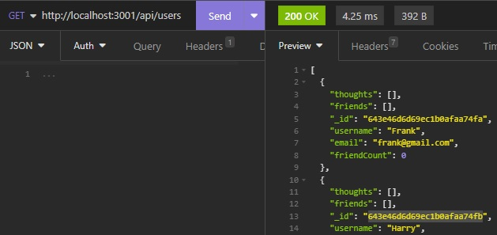

# Social Media API

## Description

- This app allows a a user (or several users) to create, update and delete their own personal account. It is here the user will be able to post thoughts to a database, where they can be reacted to by themselves and others
- The motivation to complete this challenge was to test my own skills gained in the most recent week of the coding bootcamp, including but not limited to: MongoDB, Mongoose, CRUD operators, NoSQL Models & Schemas, Instance Methods, Subdocuments Virtuals and many others.
- This project was built as a testing ground for my own retention of the aforementioned skills.
- Through building this application, I learnt that there are many programming skills outside of what we learn throughout the week, and that research and collaboration is critical in order to achieve the best outcome for any given project

## Installation

1) Install MongoDB Compass (For connection & database management)
https://www.mongodb.com/docs/compass/current/install/

2) Install Insomnia (To run queries and access specific information from the database)
https://docs.insomnia.rest/insomnia/install

3) Clone the repository using HTML or SSH Keys

4) Run npm install

Dependencies:
- express: ^4.17.1
- mongoose: ^6.9.2

## Usage

Explore the app by running the various queries found in the 'thoughtRoutes.js' and 'userRoutes.js' files. This can be done by opening Insomnia, and updating the query bar with the query that corresponds to the search that you wish to make.\
E.g. View All Users (GET): http://localhost:3001/api/users

Walkthrough Video:
https://drive.google.com/file/d/1h_G5TUGfomILQ0XpXj0AON8vHu_bKsJ5/view

## License

MIT

## How to Contribute

This project is not open for public contribution.

